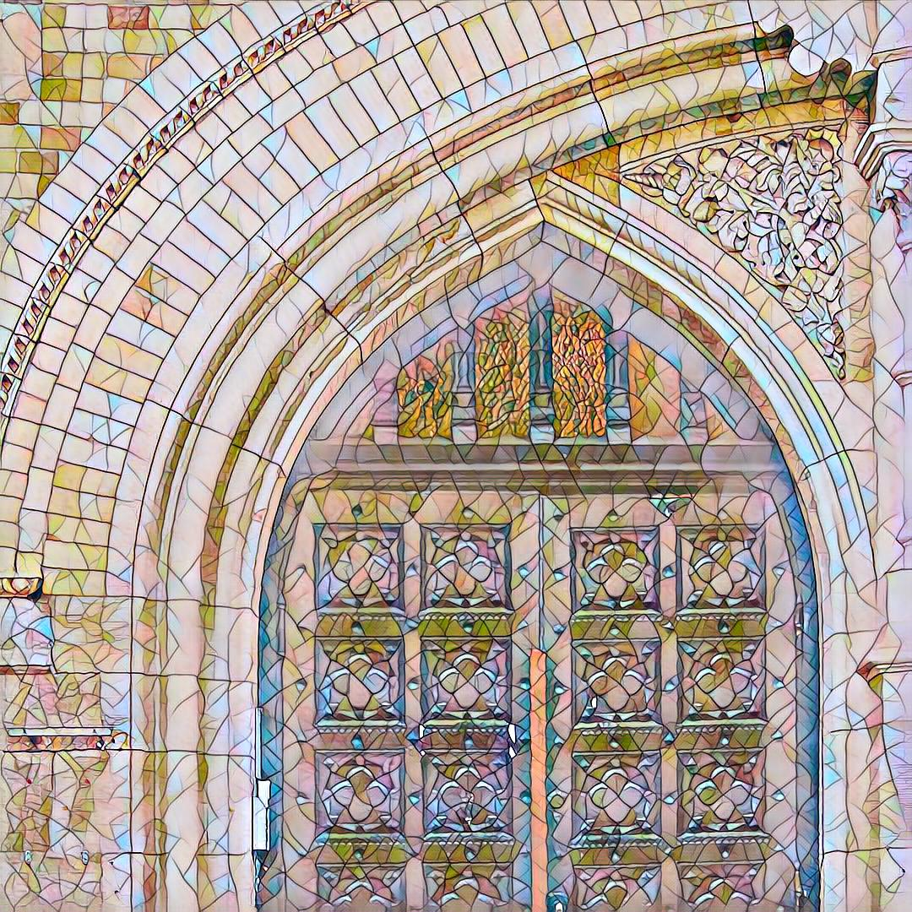

# Fast Style Transfer by PyTorch :rocket: :art: :fireworks:

This repository contains a pytorch implementation of an algorithm for artistic style transfer. It can mix the content of an image with the style of another image.

We used the model described in [Perceptual Losses for Real-Time Style Transfer and Super-Resolution](https://arxiv.org/abs/1603.08155) along with [Instance Normalization](https://arxiv.org/pdf/1607.08022.pdf).

Besides the implementation, we also explored how did parameters and network structure affect the outputs.

All the final models are in /model .

<p align="center">
    
    
    
</p>

## Dataset
We used both COCO 2014 Training images dataset[83K/13GB] and Val images dataset[41K/6GB] to train the network.

You can use `wget` to download the dataset or download it from [website](http://mscoco.org/dataset/#download) directly.

```
wget http://images.cocodataset.org/zips/train2014.zip
wget http://images.cocodataset.org/zips/val2014.zip
```

## Usage
Stylize image
```
python stylize.py --content-image </path/to/content_image> --output-image </path/to/output_image> --model </path/to/model> --cuda 0
```
* `--content-image`: path to content image you want to stylize.
* `--output-image`: path for saving the output image.
* `--model`: saved model to be used for stylizing the image (eg: `model/mosaic.pth`)
* `--cuda`: set it to 1 for running on GPU, 0 for CPU.

Train model
```
python main.py --data </path/to/train_dataset> --style-image </path/to/style_image>
```

There are several command line arguments, the important ones are listed below
* `--data`: path to training dataset, the path should point to a folder containing another folder with all the training images.
* `--style-image`: path to style image.

Refer to ``src/main.py`` for other command line arguments.
